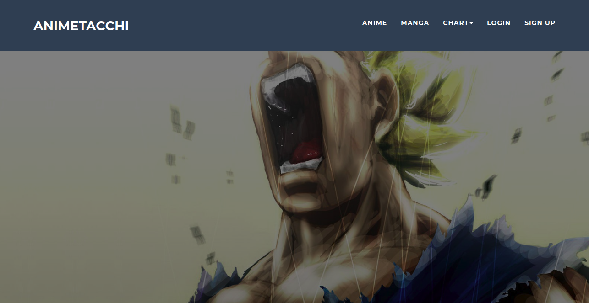
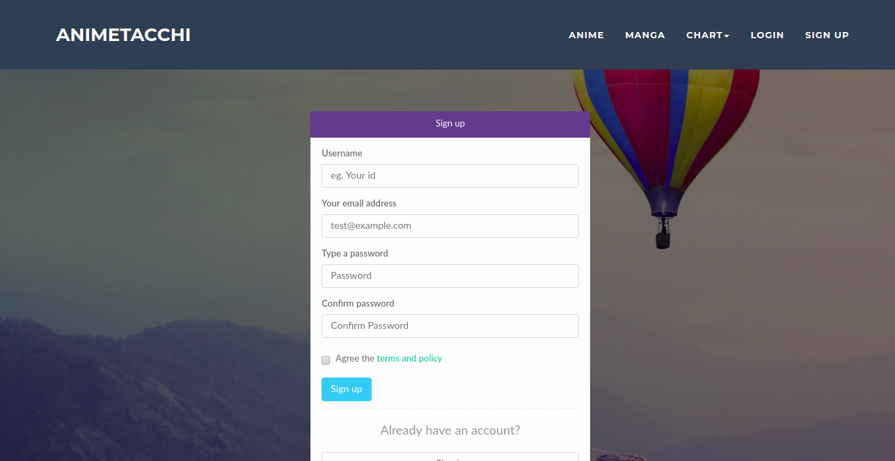
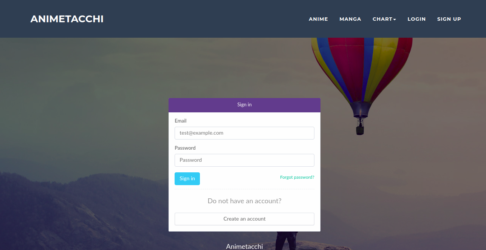
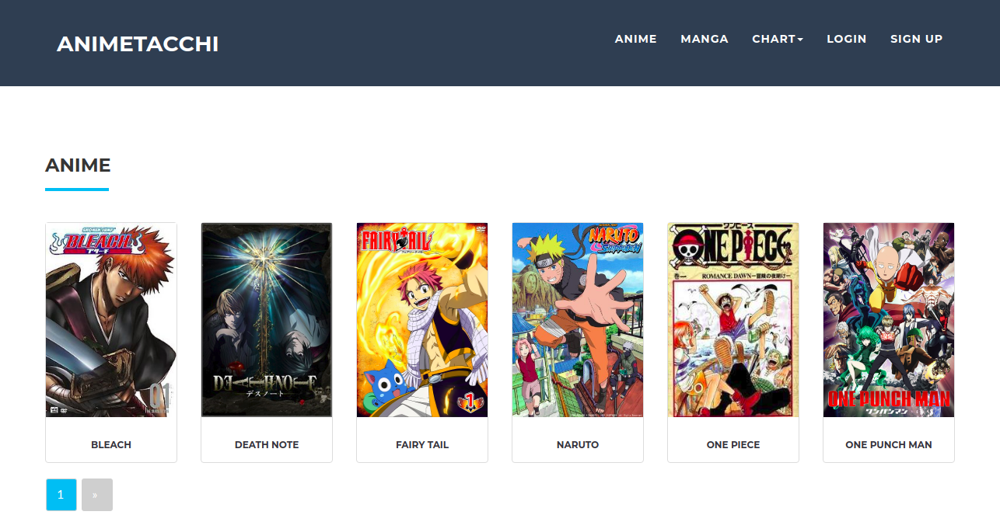
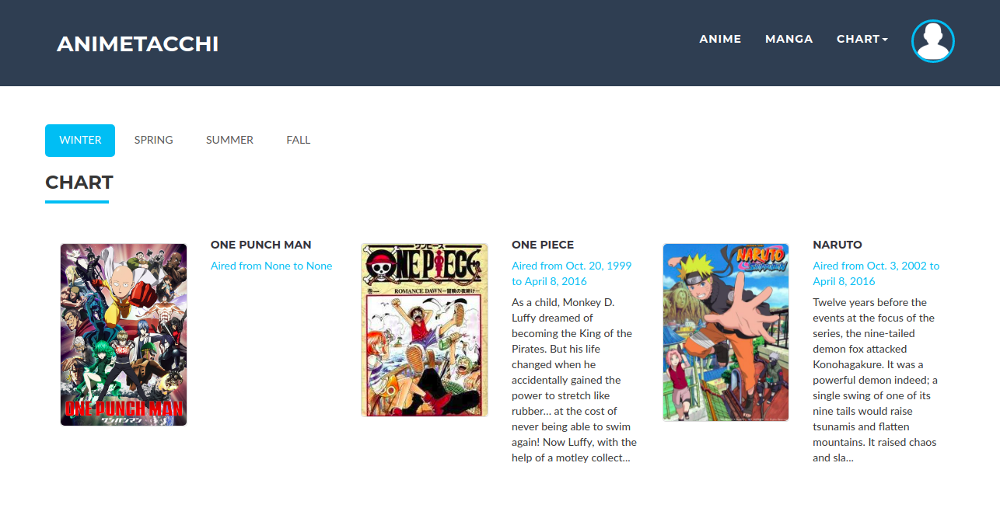
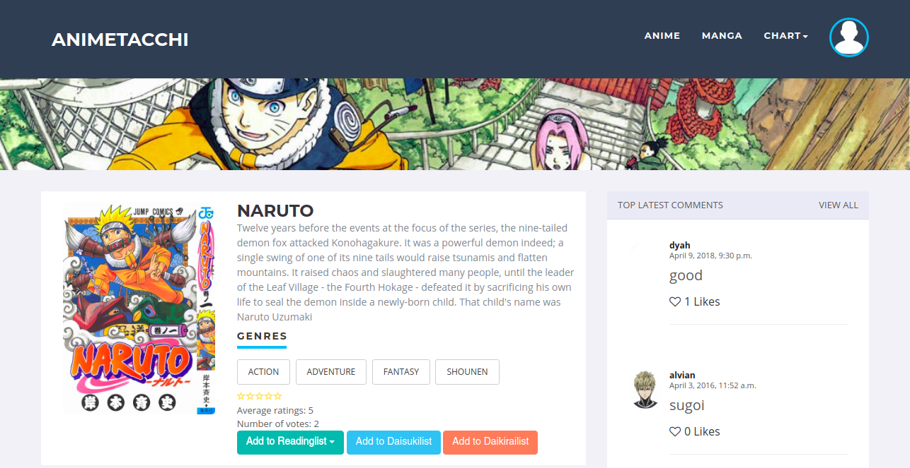
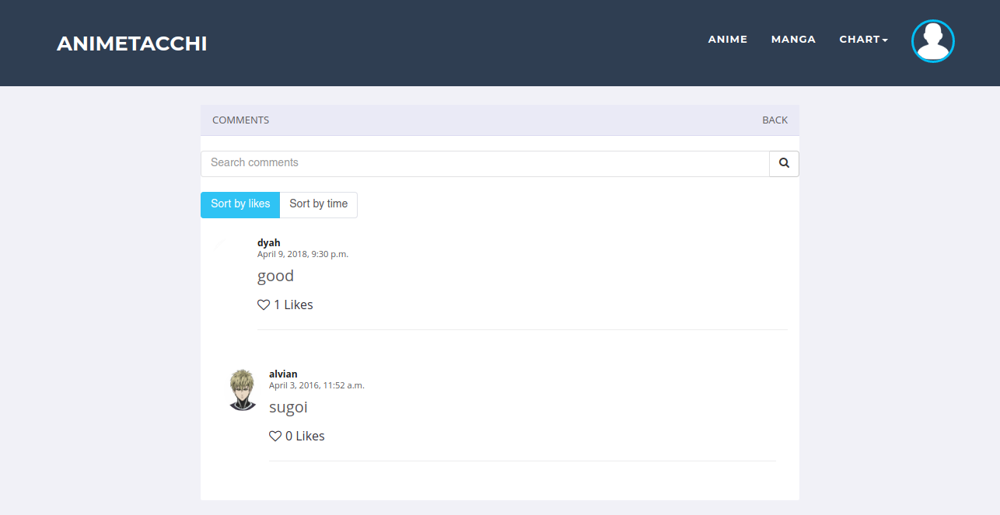
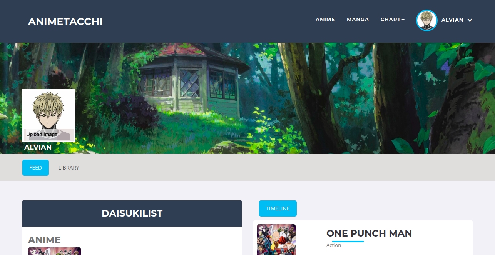
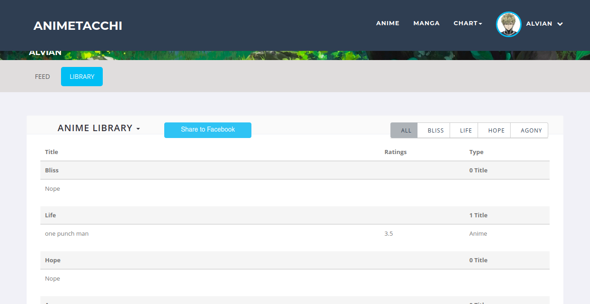

# Animetacchi
> Anime and manga review like imdb

This project is for my undergraduate thesis on April 2016. It was created with django and some ajax requests in the front end.
Some of features are including:
- List of Anime and Manga
- Detail of Anime and Manga
- List of character of anime or manga
- Detail of character
- Give rating on anime or manga
- Adding anime or manga to his library on dashboard
- Comment on Anime and Manga and give like on it
- Login and Signup
- User Dashboard

## Home

## User Signup

## User Login

## User Explore on Anime List or Season Chart

## User Explore on Anime Detail

## User can create a comment and like on another user's comment.

## There will be feed on the user feed and library.

